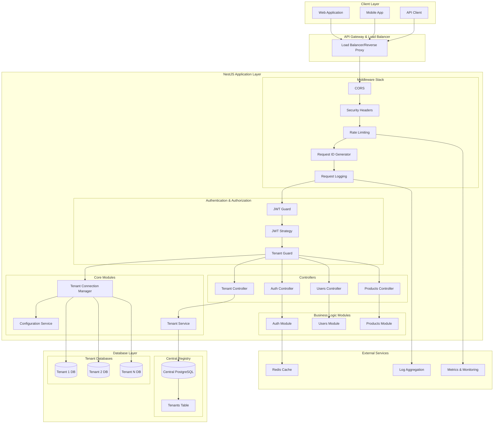
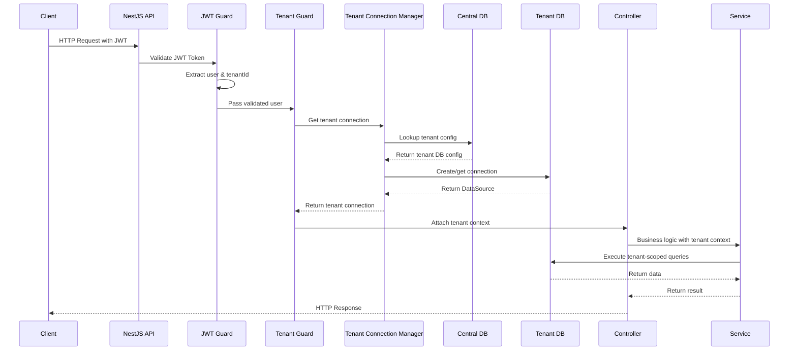
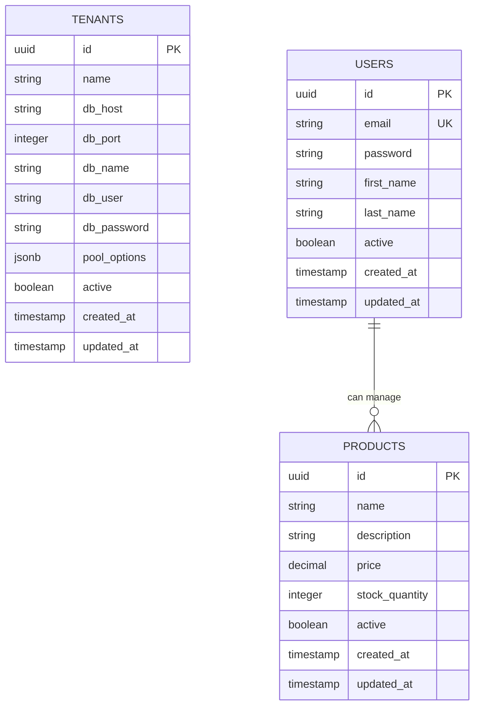
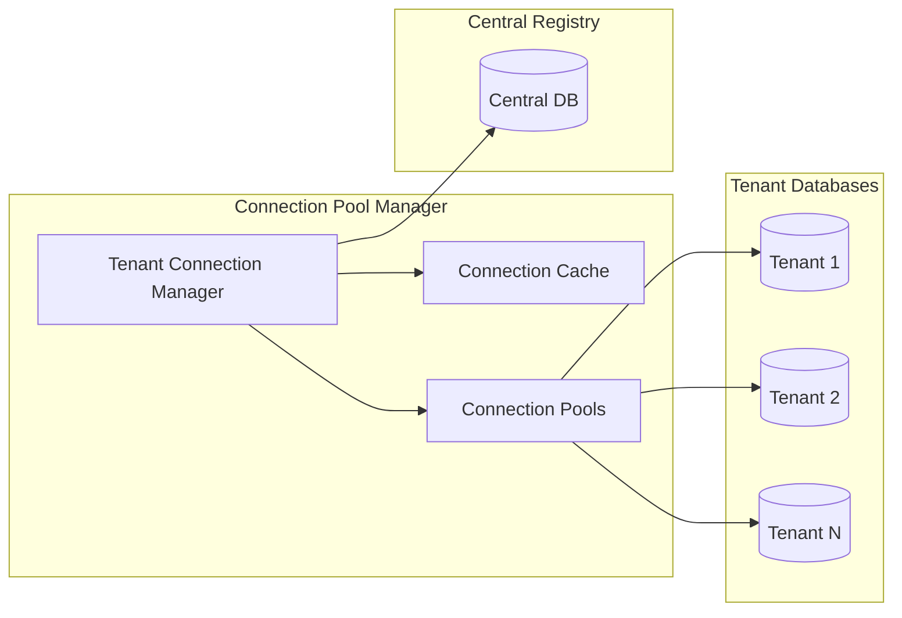
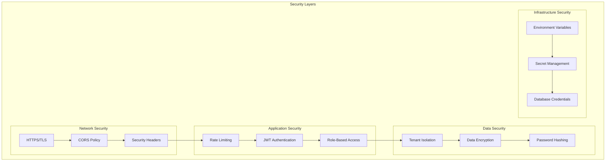
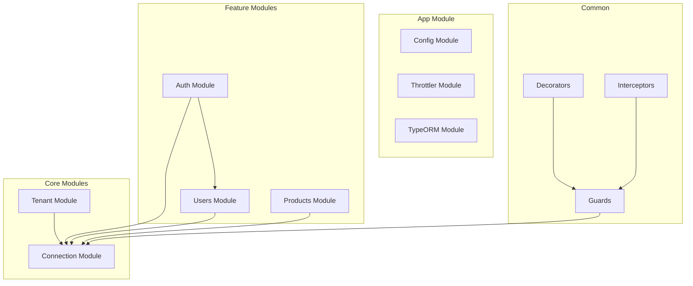
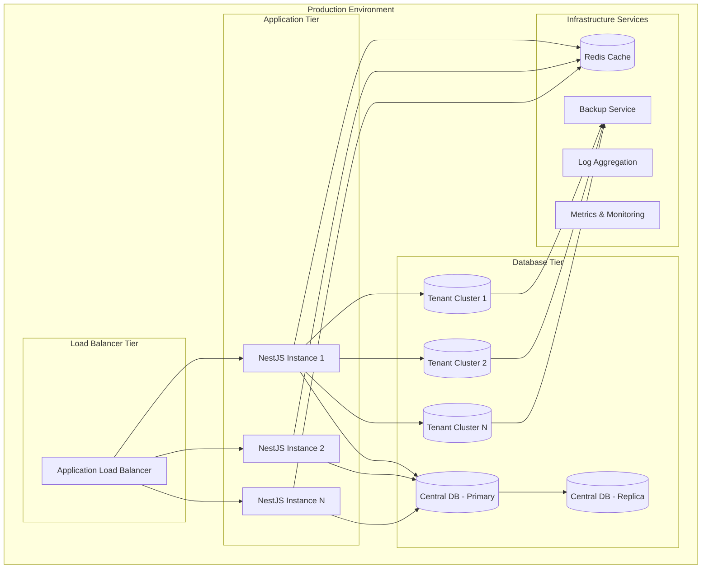

# Multi-Tenant NestJS Backend - Architecture Diagram

## 🏗️ High-Level Architecture Overview



## 🔄 Request Flow Architecture



## 🗄️ Database Architecture



## 🏢 Multi-Tenant Architecture Patterns

### 1. Database-Per-Tenant Pattern

```
Central Registry DB
├── tenants table
└── tenant configurations

Tenant A Database
├── users table
├── products table
└── other business entities

Tenant B Database
├── users table
├── products table
└── other business entities
```

### 2. Connection Management



## 🔐 Security Architecture



## 🏗️ Module Architecture



## 🔧 Component Breakdown

### Core Components

| Component                     | Purpose                                 | Key Features                                                      |
| ----------------------------- | --------------------------------------- | ----------------------------------------------------------------- |
| **Tenant Connection Manager** | Manages database connections per tenant | Connection pooling, thread-safe initialization, automatic cleanup |
| **JWT Guard**                 | Validates authentication tokens         | Token validation, user extraction, security                       |
| **Tenant Guard**              | Resolves tenant context                 | Tenant validation, connection attachment, isolation               |
| **Auth Service**              | Handles authentication logic            | Login/logout, token generation, user validation                   |
| **Tenant Service**            | Manages tenant lifecycle                | Creation, configuration, database setup                           |

### Data Flow Components

| Layer              | Components                    | Responsibilities                                                   |
| ------------------ | ----------------------------- | ------------------------------------------------------------------ |
| **Presentation**   | Controllers, DTOs, Validation | Request handling, response formatting, input validation            |
| **Business Logic** | Services, Domain Logic        | Business rules, data transformation, orchestration                 |
| **Data Access**    | Repositories, Entities        | Data persistence, query optimization, transaction management       |
| **Infrastructure** | Connection Manager, Config    | Database connections, environment configuration, external services |

## 🚀 Deployment Architecture



## 📊 Performance Considerations

### Connection Pooling Strategy

```
Tenant Connection Manager
├── Connection Cache (In-Memory)
│   ├── Active Connections: Map<tenantId, DataSource>
│   ├── Initialization Promises: Map<tenantId, Promise>
│   └── Connection Cleanup: TTL-based eviction
├── Pool Configuration
│   ├── Max Connections per Tenant: 10
│   ├── Connection Timeout: 60s
│   └── Idle Timeout: 5 minutes
└── Health Monitoring
    ├── Connection Health Checks
    ├── Failed Connection Retry Logic
    └── Circuit Breaker Pattern
```

### Scalability Patterns

1. **Horizontal Scaling**: Multiple NestJS instances
2. **Database Sharding**: Tenant databases across different clusters
3. **Caching Strategy**: Redis for session management and frequent queries
4. **Connection Optimization**: Lazy loading and connection reuse
5. **Resource Isolation**: Tenant-specific resource limits

This architecture provides a robust, scalable, and secure multi-tenant backend solution with clear separation of concerns and efficient resource management.
